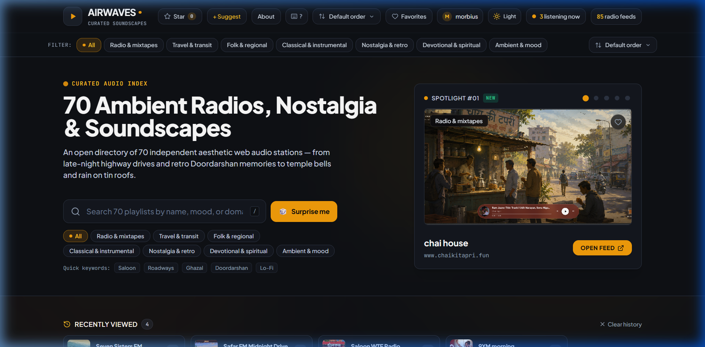
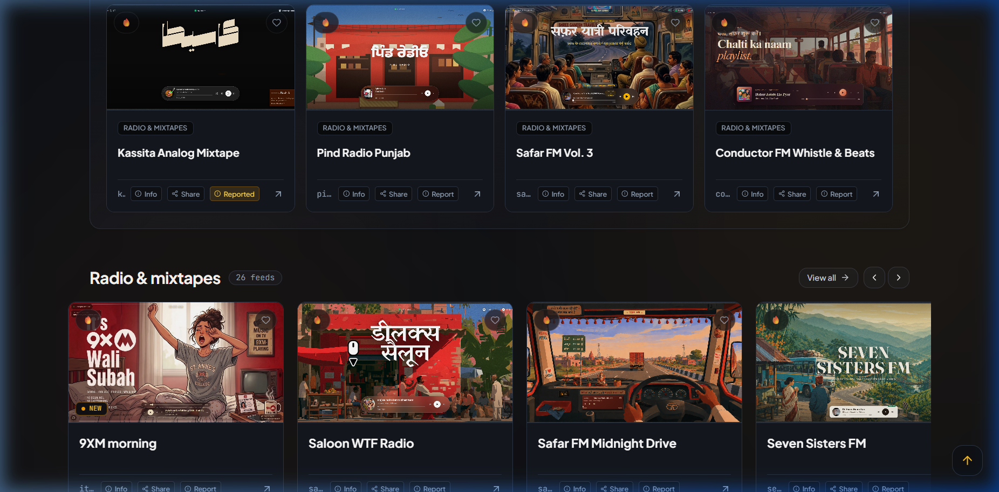
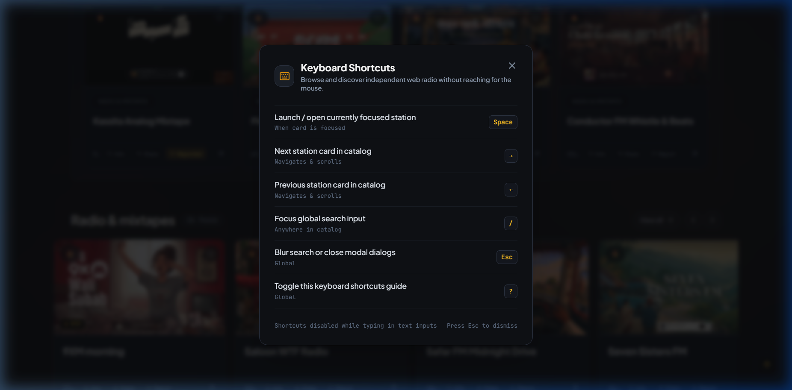
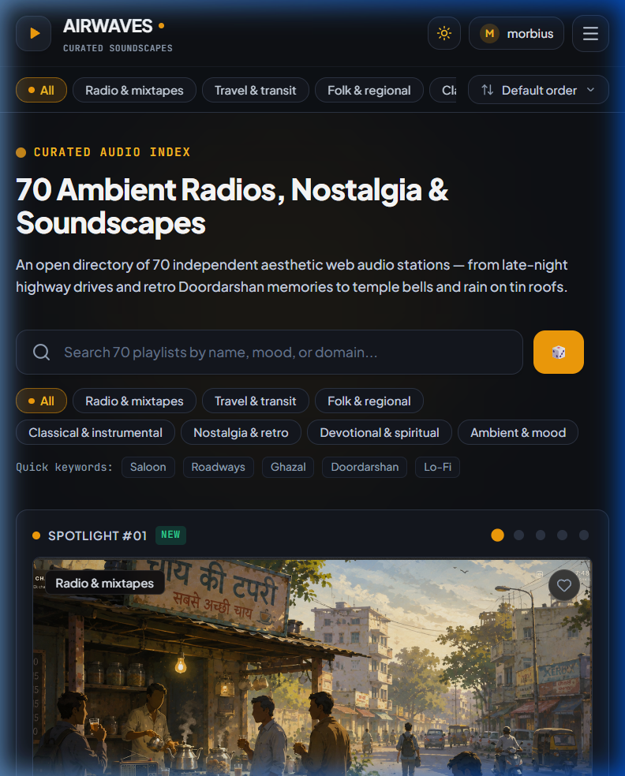

# 📻 Airwaves

> A curated directory of independent web radio, audio playlists & soundscape projects. Human-picked. No algorithms. Zero ads.

<p align="left">
  <a href="https://github.com/SubhamPro11/airwaves/blob/main/LICENSE"></a>
  <a href="https://github.com/SubhamPro11/airwaves/stargazers"></a>
  <a href="https://playit.morbius.workers.dev"></a>
  <a href="https://supabase.com"></a>
  <a href="https://react.dev"></a>
</p>

[**🌐 Live Site → playit.morbius.workers.dev**](https://playit.morbius.workers.dev)

⭐ **Star this repo** to get new drops first — new categories, new stations, and upcoming redesigns get announced here ([Releases](https://github.com/SubhamPro11/airwaves/releases) / [Discussions](https://github.com/SubhamPro11/airwaves/discussions)) before they hit the live site.

---

## 📸 Preview

### Desktop Experience


<br />

<p align="center">
  
  
</p>

### Mobile Experience
<p align="center">
  
</p>

---

## ✨ What It Is

**Airwaves** is an open, hand-curated directory of **85+ independent web radio stations, long-distance highway bus mixtapes, ambient soundscape projects, retro TV audio archives, and regional folk music**. Every single entry is hand-picked — nothing is auto-scraped, sponsored, or ranked by engagement algorithms.

- 📻 **85+ Curated Stations** across 7 distinct categories:
  - *Radio & mixtapes*
  - *Travel & transit*
  - *Folk & regional*
  - *Classical & instrumental*
  - *Nostalgia & retro*
  - *Devotional & spiritual*
  - *Ambient & mood*
- 🏷️ **Category Filter Chips** — filter by any category in the sticky header or hero bar with touch-scroll support on mobile, combining smoothly with sorting and favorites.
- 🌟 **Automated "NEW" Badges** — subtle amber badges with the brand dot automatically highlight stations added within the last 14 days based on real database records.
- 🚩 **Report Broken Link System** — low-friction two-step reporting (`Report` → `Confirm?`) with session deduplication, anonymous Supabase sync, and zero auto-delisting.
- ⌨️ **Keyboard Shortcuts & Typing Guards**:
  - `Space` — Launch / open focused station
  - `→` / `←` — Previous / next station navigation with auto-scrolling
  - `/` — Focus global search bar
  - `?` — Toggle keyboard shortcuts guide
  - `Esc` — Blur search or dismiss modals
  - *Airtight guards guarantee typing in search, suggestions, or admin fields is never hijacked.*
- 🌑 **Sleek Dark Theme** — tailored with amber/orange accents (`#f59e0b`), dark glassmorphic surfaces, and zero visual clutter.
- 🚫 **Zero Ads & Zero Tracking** — no cookies, no analytics tracking, no algorithmic manipulation.
- 🔗 **Permalinks to Every Entry** with dynamic OpenGraph previews and direct creator attribution.
- 🛠️ **Full Admin Dashboard** — for reviewing submissions, managing the catalog, and monitoring link health with visitor report triage.

---

## 🛠️ Tech Stack

- **Frontend Framework**: [React 18](https://react.dev/) + [TypeScript](https://www.typescriptlang.org/)
- **Bundler & Dev Server**: [Vite](https://vitejs.dev/)
- **Styling**: [Tailwind CSS](https://tailwindcss.com/) + PostCSS + Custom Design Tokens
- **Icons**: [Lucide React](https://lucide.dev/)
- **Database & Storage Layer**: [Supabase](https://supabase.com/) (PostgreSQL with Row Level Security)
- **Authentication**: Supabase Auth (Email / Password RBAC)
- **Deployment & Hosting**: [Cloudflare Workers](https://workers.cloudflare.com/) / Pages with prerendered static HTML & sitemaps

---

## 🚀 Getting Started

### Prerequisites

- [Node.js](https://nodejs.org/) (v18.x or higher recommended)
- [npm](https://www.npmjs.com/) or [pnpm](https://pnpm.io/)

### Installation & Local Setup

1. **Clone the repository:**
   ```bash
   git clone https://github.com/SubhamPro11/airwaves.git
   cd airwaves
   ```

2. **Install dependencies:**
   ```bash
   npm install
   ```

3. **Configure environment variables:**
   Copy the example `.env.example` file to `.env`:
   ```bash
   cp .env.example .env
   ```

   Configure your keys inside `.env`:
   ```env
   # Supabase Configuration
   VITE_SUPABASE_URL=https://your-project-id.supabase.co
   VITE_SUPABASE_ANON_KEY=your_supabase_anon_public_key_here
   VITE_SITE_URL=https://airwaves.dpdns.org
   ```

4. **Start the development server:**
   ```bash
   npm run dev
   ```
   Open [http://localhost:3000](http://localhost:3000) in your browser.

5. **Build for production:**
   ```bash
   npm run build
   ```

---

## 🔐 Environment Variables

| Variable | Description | Required |
| :--- | :--- | :--- |
| `VITE_SUPABASE_URL` | REST / API URL for Supabase instance | Yes (for live DB sync) |
| `VITE_SUPABASE_ANON_KEY` | Anonymous public API key for client queries | Yes (for live DB sync) |
| `VITE_SITE_URL` | Canonical public URL for SEO and OpenGraph permalinks | Optional |

> **Note:** If Supabase environment variables are omitted, Airwaves automatically falls back to static seed data with local `localStorage` persistence.

---

## 🤝 Contributing

Contributions are welcome — especially new station submissions!

- **Adding a station:** Submit via the on-site **"Suggest a Station"** modal (`+ Suggest`), open a Pull Request, or file an Issue.
- **Bug fixes & Features:** Please open an Issue first so we can align on design and approach before writing code.
- **Design consistency:** Keep all UI aligned with the dark theme, amber/orange accents (`#f59e0b`), and distraction-free philosophy.

See [CONTRIBUTING.md](CONTRIBUTING.md) for further guidelines and submission formatting.

---

## 📄 License

This project is licensed under the [MIT License](LICENSE).

---

## 💖 Credits & Acknowledgments

- Built and maintained by [**Subham Kumar (Cryo)**](https://github.com/SubhamPro11).
- Every radio station, live broadcast, and soundscape listed is credited to its respective creator/broadcaster on its entry page.
